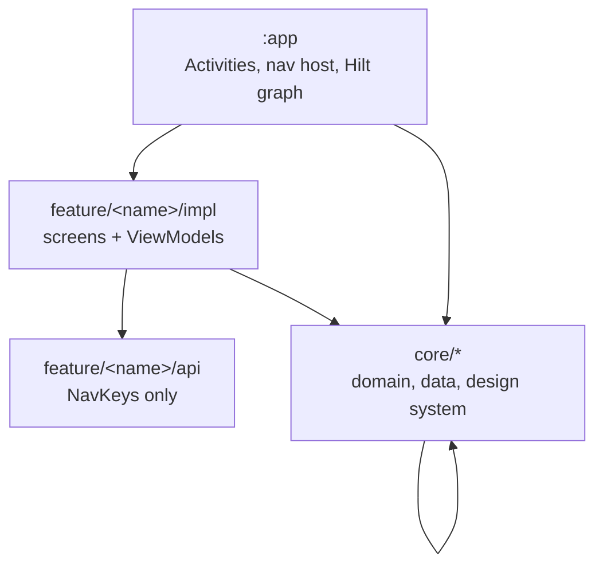

<div align="center">


# ApkAnalyzer

**Detailed reports of every app on your device — no root, no ads, nothing leaves the phone.** 📱

[](https://github.com/MartinStyk/AndroidApkAnalyzer/actions/workflows/ci.yml)
[](https://github.com/MartinStyk/AndroidApkAnalyzer/actions/workflows/release.yml)
[](LICENSE)
[](gradle/libs.versions.toml)
[](build-logic/convention/src/main/kotlin/sk/styk/martin/apkanalyzer/utils/AndroidSdk.kt)
[](https://play.google.com/store/apps/details?id=sk.styk.martin.apkanalyzer)
[](CONTRIBUTING.md)

*The most downloaded APK analysis app on Google Play — shipping since 2017, now rebuilt as a
multi-module Jetpack Compose app.*

<a href='https://play.google.com/store/apps/details?id=sk.styk.martin.apkanalyzer'></a>

</div>

---

## Table of contents

- [What it does](#what-it-does)
- [Why it exists](#why-it-exists)
- [Privacy and permissions](#privacy-and-permissions)
- [Requirements](#requirements)
- [Tech stack](#tech-stack)
- [Architecture](#architecture)
- [Getting started](#getting-started)
- [Repository layout](#repository-layout)
- [CI and releases](#ci-and-releases)
- [Documentation](#documentation)
- [Contributing](#contributing)
- [AI-assisted development](#ai-assisted-development)
- [Support](#support)
- [License](#license)

## What it does

- 🔎 **See what Android hides.** Every permission, certificate, component, and manifest flag,
  translated out of API-speak.
- 🔒 **100% on-device.** App data never leaves your phone — the on-device AI summary runs locally
  too.
- 🧭 **Browse by attribute, not just by app.** Flip the question around: which apps want this
  permission, share this signer, target this SDK.
- 🆓 **Free and open source.** No ads, no paywall on the raw data, GPLv3.

**Inspect one app — everything Android knows about it, in one report.**

| Group | What you get |
|---|---|
| 🪪 Identity | Package and app name, version name and code, app category, install and update dates |
| 📶 Compatibility | Target and minimum Android version, required and optional hardware features |
| 🏬 Origin | Full install-source chain — which store or app actually installed it |
| 🔏 Signing | Certificate details, issuer and subject, validity, fingerprints, signing-scheme versions |
| 🔐 Permissions | Requested and declared permissions with plain-language descriptions and protection levels |
| 🧩 Components | Activities, services, receivers and providers with intent filters, exported state, path permissions, and launch options |
| 📦 Packaging | Native libraries and ABIs, split APKs, shared UID group, manifest security flags, storage size |
| 📄 Manifest | The complete `AndroidManifest.xml`, readable |

**🧭 Browse by attribute.** Turn the question around and start from the attribute instead of the
app: which apps request a given permission, which are signed by a given certificate, what targets
each Android version, where each app came from, which share a UID, how apps spread across
categories.

**📂 Analyze `.apk` files.** Open an `.apk` from another app or pick one from storage and get the
same full report for something you haven't installed.

**🤖 On-device AI summary.** A short, factual, plain-language read on what an app is and what its
permissions and components imply — generated locally with ML Kit's GenAI prompt API. The app data
never leaves the device.

**📤 Export and share.** Export or share the APK itself, save the app icon, copy or share a text
summary, and launch an app's components directly.

## Why it exists

Android tells you very little about the software you already run. Apk Analyzer surfaces the whole
manifest-level truth about every installed app in a form a human can read — no root, no ads, no
paywall on the raw data. Raw facts stay free by design; see the
[roadmap](docs/product/roadmap.md) for where interpretation features are heading.

## Privacy and permissions

App analysis runs entirely on device. The app declares exactly two sensitive permissions, both
needed for the core feature:

| Permission | Why |
|---|---|
| `QUERY_ALL_PACKAGES` | Read the list and details of installed apps — this is what the app is for |
| `PACKAGE_USAGE_STATS` | Optional. Powers last-used times and storage size breakdowns; granted by you in system settings |

App-analysis data is processed on device. Network use is limited to Firebase telemetry (Analytics,
Crashlytics, Performance) and ML Kit downloading the on-device AI model. See
[`PRIVACY_POLICY.MD`](PRIVACY_POLICY.MD).

## Requirements

Android 9 (API 28) or newer. The AI summary additionally needs a device that supports on-device
generative AI; everything else works everywhere.

---

## Tech stack

| Layer | Choice |
|---|---|
| Language | Kotlin, coroutines + `Flow` exclusively for async work |
| UI | Jetpack Compose only — no XML layouts |
| DI | Hilt |
| Navigation | Navigation 3 (`androidx.navigation3`) |
| Persistence | Room, DataStore Preferences |
| On-device AI | ML Kit GenAI Prompt API |
| Images | Coil 3 |
| Build | Gradle version catalog + custom convention plugins (`build-logic/`) |
| Backend services | Firebase (Analytics, Crashlytics, Performance, App Distribution) |
| Static analysis | Spotless (ktlint + compose-rules-ktlint), Detekt, Android Lint, LeakCanary in debug |
| Min / target SDK | 28 / 37 |

Exact versions live in [`gradle/libs.versions.toml`](gradle/libs.versions.toml) — that file is the
single source of truth; nothing pins a version elsewhere.

## Architecture

A multi-module Gradle project with one strict dependency direction: `app` → `feature/*/impl` →
`feature/*/api` + `core/*`, and `core/*` never looks back at a feature.



`feature/*/api` holds only NavKeys, so features navigate to each other without compiling against
each other's implementation; `core/*` never depends on a feature; `app` is wiring only. The same
three shapes repeat everywhere, which is why an unfamiliar file is rarely a surprise: one ViewModel
shape (a single `StateFlow<State>`, a single `onAction`, one-shot `Event`s over a `Channel`), one
data-layer shape (public `interface` + `internal Impl`, never throwing, injected dispatchers), and a
design system rather than Material scattered across features. Every module carries its own
`AGENTS.md` with its boundary and package map.

**Full details → [`docs/engineering/architecture.md`](docs/engineering/architecture.md)** — dependency
rules, the module ownership table, navigation, and each shape with production references.

## Getting started

**Prerequisites:** Android Studio (latest stable). That's genuinely it — the Gradle setup
auto-provisions a matching JDK on first build, and Android Studio's SDK Manager covers the Android
SDK. The [`setup-local-tools`](.claude/skills/setup-local-tools/SKILL.md) skill has the full
breakdown, including headless/CLI-only setup and optional tools.

```bash
git clone https://github.com/MartinStyk/AndroidApkAnalyzer.git
cd AndroidApkAnalyzer
./gradlew assembleDebug   # first build downloads Gradle, the JDK, and all dependencies
```

`app/google-services.json` is committed, so the Firebase Gradle plugins compile out of the box with
nothing to configure. CI replaces it with a freshly fetched config at build time.

**Common tasks:**

```bash
./gradlew installDebug          # build + install debug on a connected device/emulator
./gradlew spotlessApply         # auto-fix formatting — run before every commit
./gradlew :feature:apps:impl:compileDebugKotlin   # fast single-module check while iterating
./gradlew spotlessCheck detektDebug lintDebug :app:assembleDebug   # what CI gates on
./gradlew validateAgentContext  # verify the shared Claude/Copilot context files
```

Version name and code come from Gradle properties (`-Pversion.name=`, `-Pversion.code=`) and default
to a local `dev` build.

Spotless auto-fixes formatting, Detekt fails on warnings, Android Lint checks Android correctness,
and LeakCanary watches for leaks in debug builds. What each one enforces, and the two things no gate
catches, are in [`docs/engineering/verification.md`](docs/engineering/verification.md).

Writing code? Conventions — the no-comments policy, returning `Result`/nullable instead of throwing,
injected dispatchers, keeping `MutableStateFlow` private behind a read-only view, and combining
sources into a single screen state — are in
[`docs/engineering/coding-standards.md`](docs/engineering/coding-standards.md).

## Repository layout

```
app/           Activities, nav host, app-scoped Hilt bindings — wiring only
core/          Domain, data, and design-system modules
feature/       One api + impl pair per feature area
build-logic/   Convention plugins; SDK levels and the JVM toolchain live here
config/        Detekt and static-analysis configuration
docs/          Product roadmap and feature design, engineering docs, technical decision records
.claude/       Task skills shared by Claude and Copilot
gradle/        Version catalog and wrapper
```

## CI and releases

Every push and PR to `develop` verifies the project and builds a debug APK artifact; pushes also go
out to internal testers. An annotated `MAJOR.MINOR.PATCH` tag builds and signs an AAB and APK,
publishes a GitHub release, and uploads to the Play Store beta track — production is a separate,
manual promotion. The four workflows, their triggers, and the secrets they need are in
[`docs/engineering/ci-and-release.md`](docs/engineering/ci-and-release.md).

## Documentation

**For users and anyone evaluating the app**

| Doc | What it covers |
|---|---|
| [`docs/product/roadmap.md`](docs/product/roadmap.md) | Open scope and sequencing, with stable IDs |
| [`docs/product/shipped.md`](docs/product/shipped.md) | What has shipped or been deliberately retired, and why |
| [`docs/product/features/`](docs/product/README.md) | One design doc per feature, written before it's built |
| [`PRIVACY_POLICY.MD`](PRIVACY_POLICY.MD) | What leaves the device, and what doesn't |

**For contributors and technical reviewers**

| Doc | What it covers |
|---|---|
| [`CONTRIBUTING.md`](CONTRIBUTING.md) | How to propose, build, and submit a change |
| [`AGENTS.md`](AGENTS.md) | The canonical, terse engineering rules — humans and agents read this first |
| [`docs/engineering/architecture.md`](docs/engineering/architecture.md) | Module graph, dependency rules, module ownership, the three repeating shapes |
| [`docs/engineering/coding-standards.md`](docs/engineering/coding-standards.md) | Conventions before you write code, with real examples from the codebase |
| [`docs/engineering/verification.md`](docs/engineering/verification.md) | Spotless, Detekt, Lint, LeakCanary — what each enforces and what gates CI |
| [`docs/engineering/ai-workflow.md`](docs/engineering/ai-workflow.md) | Per-module `AGENTS.md`, `validateAgentContext`, and the shared skills |
| [`docs/engineering/ci-and-release.md`](docs/engineering/ci-and-release.md) | The GitHub Actions workflows, the release pipeline, and production promotion |
| [`docs/technical/`](docs/technical/README.md) | Cross-cutting engineering decisions and audits |
| [`.claude/skills/`](.claude/skills) | Step-by-step procedures for recurring tasks, shared by Claude and Copilot |

---

## Contributing

Contributions are welcome. Start with [`CONTRIBUTING.md`](CONTRIBUTING.md) for the workflow, then
[`docs/engineering/architecture.md`](docs/engineering/architecture.md) and
[`docs/engineering/coding-standards.md`](docs/engineering/coding-standards.md) for module boundaries
and conventions. By participating you agree to the [Code of Conduct](CODE_OF_CONDUCT.md).

Good first contributions: a **translation** (the app currently ships English and Japanese, and a PR
touching only `strings.xml` files needs no prior discussion), or anything marked open in the
[roadmap](docs/product/roadmap.md).

## AI-assisted development

Both Claude and GitHub Copilot are supported for working on this codebase, reading the same
`AGENTS.md` context files and shared `.claude/skills/`. Details →
[`docs/engineering/ai-workflow.md`](docs/engineering/ai-workflow.md).

## Support

* **Bugs and feature requests** — [open an issue](https://github.com/MartinStyk/AndroidApkAnalyzer/issues)
* **Security vulnerabilities** — see [`SECURITY.md`](SECURITY.md); please don't file a public issue
* **Using the app** — the [Play Store listing](https://play.google.com/store/apps/details?id=sk.styk.martin.apkanalyzer)
  is the place for reviews and general feedback

## License

Licensed under the [GNU General Public License v3.0](LICENSE).
