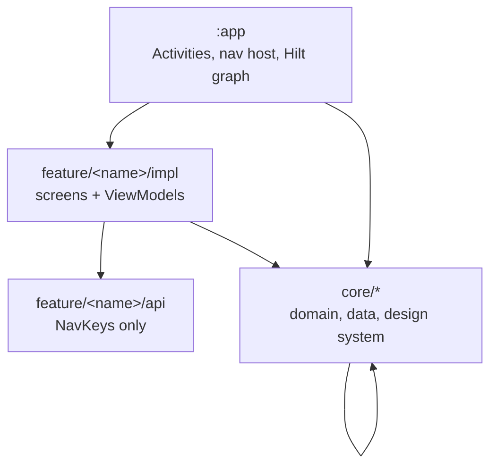

# Architecture

How the modules fit together, which direction dependencies are allowed to point, and the
conventions that repeat across the codebase. The canonical short version lives in
[`AGENTS.md`](../../AGENTS.md); this document is the expanded reading of it for a contributor or
reviewer who wants the reasoning, not just the rule.

## The module graph

[`settings.gradle.kts`](../../settings.gradle.kts) is the authoritative module list.

## Dependency rules

* **`feature/*/api` depends on nothing.** It holds only `@Serializable` NavKeys and the feature's
  tab label. This is what lets one feature navigate into another without compiling against its
  implementation — the whole point of the api/impl split.
* **`feature/*/impl` depends on its own `api` plus whichever `core` modules it needs.** Never on
  another feature's `impl`. If two features need the same behaviour, it moves into a `core` module.
* **`core/*` may depend on other `core` modules, never on a `feature`.**
* **`app` is wiring only** — the launcher Activity, the external-APK document Activity, nav hosts,
  and app-scoped Hilt bindings. No feature logic lands here.
* A module's package matches its directory with hyphens removed: `core/user-preferences` →
  `core.userpreferences`, `feature/app-detail/impl` → `feature.appdetail.impl`.

## Module ownership

| Module | Owns |
|---|---|
| [`core:apps`](../../core/apps/AGENTS.md) | Installed-app and APK analysis: extraction, normalization, caching, domain models |
| [`core:apk-files`](../../core/apk-files/AGENTS.md) | Temporary materialization and cleanup of APKs received via content URIs |
| [`core:app-index`](../../core/app-index/AGENTS.md) | Device-wide `attribute → apps` indexes behind Browse |
| [`core:app-permissions`](../../core/app-permissions/AGENTS.md) | The deduplicated device-wide permission list |
| [`core:ai-insights`](../../core/ai-insights/AGENTS.md) | On-device AI features and the ML Kit engine wrapper |
| [`core:user-preferences`](../../core/user-preferences/AGENTS.md) | Recently viewed apps and search history |
| [`core:navigation`](../../core/navigation/AGENTS.md) | Navigation 3 infrastructure for independent bottom-nav stacks |
| [`core:ui-library`](../../core/ui-library/AGENTS.md) | The design system: theme, icons, components, animation metadata |
| [`core:common`](../../core/common/AGENTS.md) | Dispatchers, logging, and models shared across domains |
| [`feature:apps`](../../feature/apps/AGENTS.md) | The installed-app list: search, filter, sort |
| [`feature:app-detail`](../../feature/app-detail/AGENTS.md) | The full report for one app or APK |
| [`feature:browse`](../../feature/browse/AGENTS.md) | Browse by attribute |
| [`feature:settings`](../../feature/settings/AGENTS.md) | Theme and app settings |

A core module packages by domain once it holds more than one repository/manager family:
[`core:apps`](../../core/apps/AGENTS.md) is the worked example, with `signing/`, `permissions/`,
`components/`, `manifest/`, `installsource/`, `devicefeatures/`, `packaging/`, `usagestats/`,
`storagestats/`, `export/`, and `sdkversion/` each holding their own interface, implementation, and
models. A module with a single family (`core:app-index`, `core:apk-files`) has not earned that split
and does not pre-empt it.

## ViewModel conventions

Every ViewModel extends `ViewModel()` directly, with no base class, and exposes exactly three
things:

* one `val state: StateFlow<FeatureState>`
* one `val events: Flow<FeatureEvent>`, when the screen has one-shot signals to send
* one `fun onAction(action: FeatureAction)` with a `when` dispatch

Nothing else is public. The supporting types are equally fixed:

* **State** — a `sealed interface` or an `@Immutable data class`. Never holds lambdas.
* **Action** — a `sealed interface` of UI → ViewModel intents.
* **Event** — a `sealed interface` of one-shot ViewModel → UI signals (navigation, toasts, system
  intents), delivered over `Channel<Event>(Channel.BUFFERED)` exposed as `receiveAsFlow()`. Never
  state.

Composables read state with `collectAsStateWithLifecycle()` and consume events in a
`LaunchedEffect`.

When a ViewModel needs a runtime parameter it uses
`@HiltViewModel(assistedFactory = VM.Factory::class)` with `@AssistedInject`, rather than reading
arguments out of a `SavedStateHandle`.

Production references:

* [`AppDetailViewModel`](../../feature/app-detail/impl/src/main/kotlin/sk/styk/martin/apkanalyzer/feature/appdetail/impl/AppDetailViewModel.kt)
  — assisted injection, private `MutableStateFlow` sources combined into one public state.
* [`SettingsViewModel`](../../feature/settings/impl/src/main/kotlin/sk/styk/martin/apkanalyzer/feature/settings/impl/SettingsViewModel.kt)
  — the plain flow-backed shape with state, events, and actions.

## Data-layer conventions

Repositories and managers are a public `interface` plus an `internal` `Impl` in the same module,
bound with Hilt `@Binds` and scoped `@Singleton`. Interface and implementation live in separate
files; models declared alongside the interface may stay in the interface file.

* **Interface methods never throw.** They return `Result<T>`, a nullable `T?`, or an empty
  collection — see
  [`AppDetailRepository`](../../core/apps/src/main/kotlin/sk/styk/martin/apkanalyzer/core/apps/AppDetailRepository.kt)
  and
  [`AppExportManager`](../../core/apps/src/main/kotlin/sk/styk/martin/apkanalyzer/core/apps/export/AppExportManager.kt).
* **Dispatchers are injected**, never hardcoded: inject `DispatcherProvider` and switch with
  `flowOn(dispatcherProvider.default())` or `withContext(dispatcherProvider.io())`.
* Constructor injection is preferred over module `@Provides`; a `@Provides` function is for platform
  types only.

The details, including the cancellation-safe `runCatchingCancellable` wrapper, are in
[coding standards](coding-standards.md).

## Design system conventions

Feature modules never import `androidx.compose.material3`. They use Compose foundation APIs plus the
wrappers, theme, icons, and animation metadata in
[`core:ui-library`](../../core/ui-library/AGENTS.md). If a component does not exist there yet, it is
wrapped there first — the [`create-compose-component`](../../.claude/skills/create-compose-component/SKILL.md)
skill covers the procedure. `app` uses material3 directly for `Scaffold` and theme plumbing; that is
the only exception in the repository.

Colors and type come from `AppTheme.colors` / `AppTheme.typography`, icons from `ApkAnalyzerIcons`.
`MaterialTheme.colorScheme` is never reached for outside `core:ui-library`.

## Navigation

Navigation 3 (`androidx.navigation3`) only — no legacy Jetpack Navigation. NavKeys are
`@Serializable` and implement `NavKey`: a `data class` when it carries parameters, a `data object`
when it does not. Keys reachable from another feature live in `feature/*/api`; keys internal to one
feature live in that feature's `impl/navigation/`.

Each feature exposes `EntryProviderScope<NavKey>.<feature>Entries(navigator: Navigator)`, which is
wired into the `entryProvider { }` block in
[`ApkAnalyzerApp.kt`](../../app/src/main/kotlin/sk/styk/martin/apkanalyzer/ui/ApkAnalyzerApp.kt). A
screen that isn't wired there is unreachable. Multi-stack state for the bottom navigation lives in
[`core:navigation`](../../core/navigation/AGENTS.md), and the step-by-step procedure is the
[`implement-navigation`](../../.claude/skills/implement-navigation/SKILL.md) skill.

## One source of versions

[`gradle/libs.versions.toml`](../../gradle/libs.versions.toml) is the only place dependency
coordinates and versions live. SDK levels and the JVM toolchain come from
[`AndroidSdk.kt`](../../build-logic/convention/src/main/kotlin/sk/styk/martin/apkanalyzer/utils/AndroidSdk.kt)
and [`Kotlin.kt`](../../build-logic/convention/src/main/kotlin/sk/styk/martin/apkanalyzer/utils/Kotlin.kt)
in [`build-logic`](../../build-logic/AGENTS.md). Nothing is pinned inside a module's
`build.gradle.kts`.

## Related

* [Coding standards](coding-standards.md) — the conventions that apply inside these shapes
* [Verification](verification.md) — what the static-analysis gates check
* [`docs/technical/`](../technical/README.md) — cross-cutting decisions and audits, including
  [repository load performance](../technical/repository-load-performance.md)
